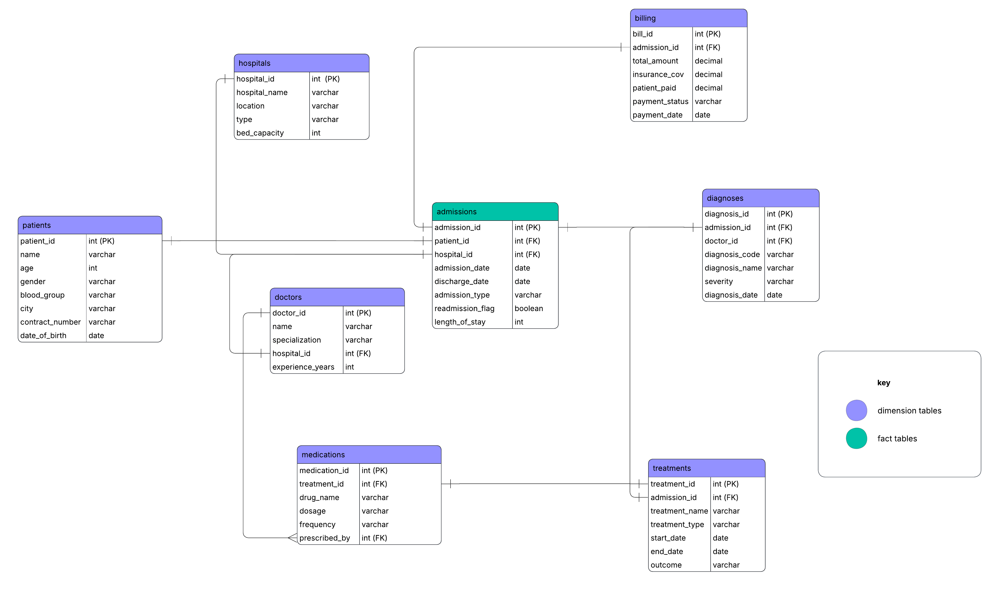
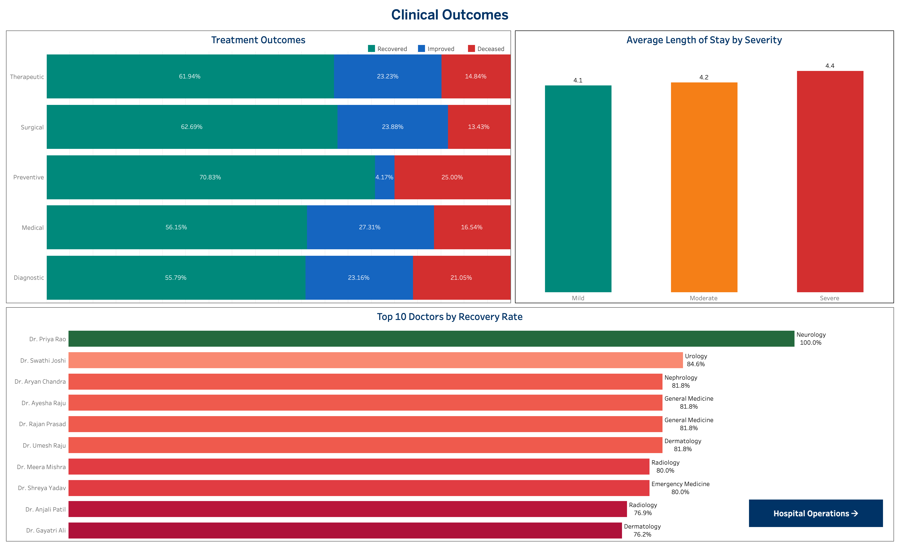
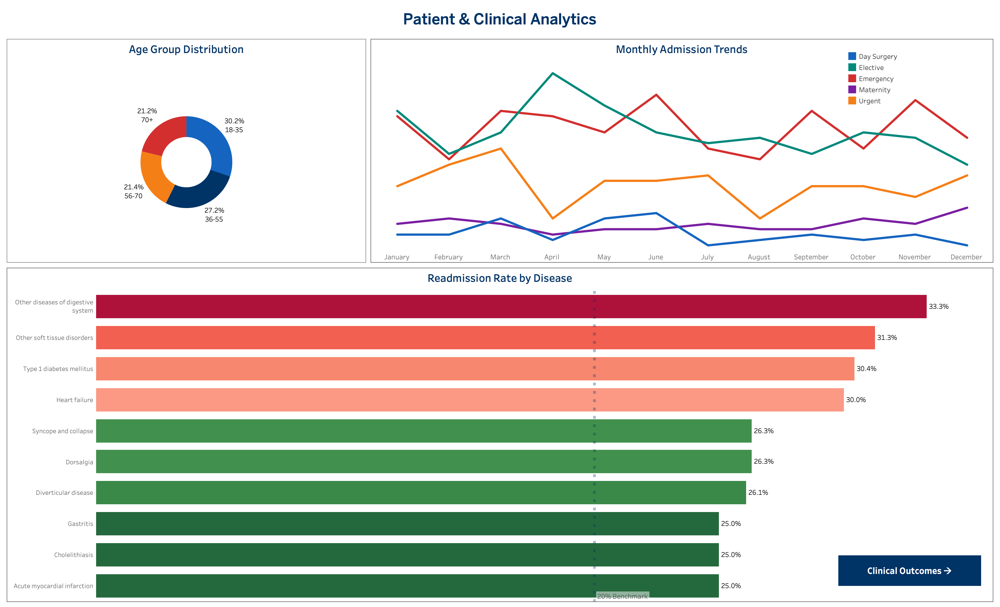
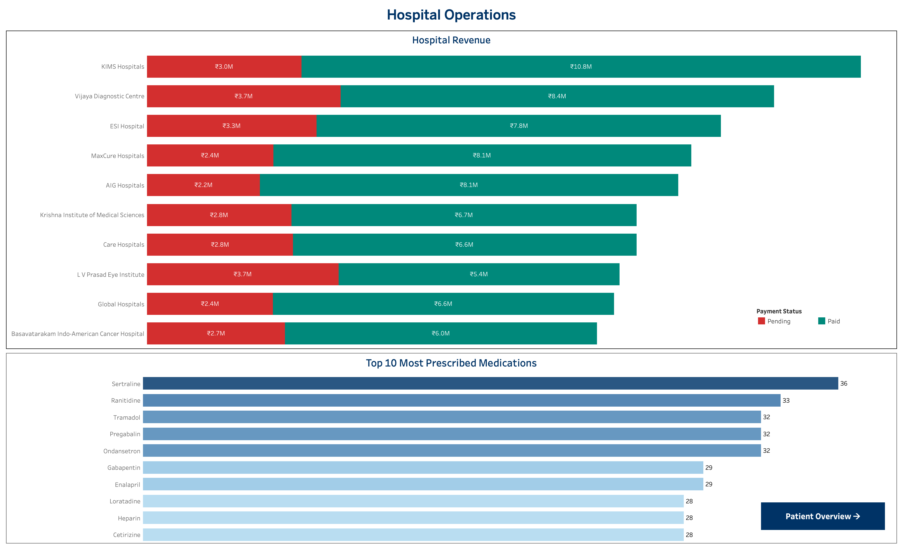

# Healthcare Patient Outcomes Analysis

🔗 [View Dashboard (Tableau Public)](https://public.tableau.com/app/profile/indrani.challa/viz/PATIENT_OUTCOMES_17806417932790/PatientOverview)

🔗 **[View Hex Notebook](https://app.hex.tech/0199335d-610a-7001-9c7d-fb84db58160d/app/Healthcare-Patient-Outcomes-032iOhIf1TWtjeMfj0h4hk/latest)**

### Executive Summary:

Readmission rates across Hyderabad hospitals are consistently above the 20% industry benchmark, and clinical teams had no unified view to understand why. Using SQL to clean and model 8 interconnected tables and Tableau to build three interactive dashboards, I surfaced where patients are struggling post-discharge, which treatments are underperforming, and where hospital revenue is sitting uncollected. After identifying that every top disease exceeds the readmission benchmark and that severe patients are being discharged too early, I recommend that clinical and operations leadership implements the following:

1. Structured post-discharge programs for the top 5 high-readmission diseases within 7 days of discharge
2. Extended length of stay for Severe-classified patients by 1–2 days
3. Standardized Surgical and Preventive protocols modeled on top-performing departments
4. Monthly billing reconciliation for hospitals with pending ratios above 30%
5. Cross-departmental knowledge-sharing led by Neurology and Urology to lift lower-performing departments

### Business Problem:

Patient readmissions are a direct signal of care quality — and a direct cost to hospitals. Leadership observed that patients were returning at rates consistently above the 20% benchmark across facilities, while clinical teams had no single view to explain why. How do we identify which diseases, treatment types, and discharge patterns are driving poor outcomes — and where billing gaps are compounding the problem across 30 hospitals?

### Methodology:
* Exploratory Data Analysis (EDA)
* SQL Data Cleaning (8 cleaned views in HEX)
* Star Schema Data Modeling
* Healthcare KPI Analysis
* Interactive Dashboard Design (Tableau)

### Skills:
* SQL (CTEs, CASE statements, subqueries, window functions)
* Data Visualization (Tableau Public)
* Data Wrangling & Cleaning
* Data Modeling (Star Schema — 8 tables)
* HEX Data Science Notebook

### Results & Business Recommendations:

Building three dashboards across patient, clinical, and operational data gives hospital administrators and clinical leads a unified view of performance — replacing fragmented reporting with a single source of truth across all 30 facilities.

**Dashboard 1 — Patient & Clinical Analytics**

The 56+ patient population accounts for nearly half of all admissions — a concentration of clinically complex patients carrying higher readmission risk. Emergency admissions spike sharply in April before declining through summer, pointing to a clear window for proactive staffing and capacity planning heading into Q1. Most significantly, every single disease in the top 10 exceeds the 20% readmission benchmark — the highest being Digestive System disorders at 33.3%, followed by Type 1 Diabetes at 30.4% and Heart Failure at 30.0%. When all 10 diseases exceed benchmark, it signals a systemic gap in post-discharge care — not disease-specific failures.

**Dashboard 2 — Clinical Outcomes**

Preventive treatment leads recovery at 70.83% but shows a binary pattern — almost no Improved segment with 25% mortality. Diagnostic is the most concerning type — lowest recovery at 55.79% and highest mortality at 21.05%, the only category crossing the 20% mortality mark. The length-of-stay finding is the most operationally significant: Mild patients average 4.1 days, Severe patients just 4.4 — a 0.3-day gap between least and most severe. Discharge decisions are not aligned with clinical severity, and this is very likely a direct driver of the high readmission rates. Dr. Priya Rao (Neurology) achieves 100% recovery — 15 percentage points above the next performers — and her protocols should be documented and replicated.

**Dashboard 3 — Hospital Operations**

KIMS Hospitals leads total revenue at ₹13.8M with a manageable 22% pending ratio. L V Prasad Eye Institute is the most concerning — roughly 41% of its revenue is uncollected, meaning ₹3.7M is sitting unrealized. Vijaya Diagnostic Centre carries a 31% pending ratio. Any hospital above 30% pending needs immediate billing reconciliation. Sertraline leads prescriptions at 36 — the presence of an antidepressant at the top alongside high chronic disease readmission rates may warrant a review of mental health co-morbidity protocols.

### Business Recommendations:

1. Implement structured post-discharge programs for Digestive, Diabetes, and Heart Failure patients — follow-up calls and medication checks within 7 days of discharge
2. Extend length of stay for Severe-classified patients by 1–2 days — the current 0.3-day gap between Mild and Severe is clinically indefensible
3. Standardize Surgical and Preventive protocols across all hospitals — Diagnostic treatment has the most room for immediate improvement
4. Launch monthly billing reconciliation targeting L V Prasad Eye Institute and Vijaya Diagnostic Centre first
5. Document Dr. Priya Rao's Neurology protocols and share across Radiology and Dermatology departments which cluster at the bottom of recovery rates

### Next Steps:

1. Investigate whether readmission patterns differ by age group — the 70+ segment may face distinct post-discharge access challenges worth a separate intervention
2. Analyze whether specific medication combinations correlate with better or worse recovery outcomes across treatment types
3. Run a deeper dive on the April emergency spike to determine whether it reflects seasonal disease patterns or capacity constraints
